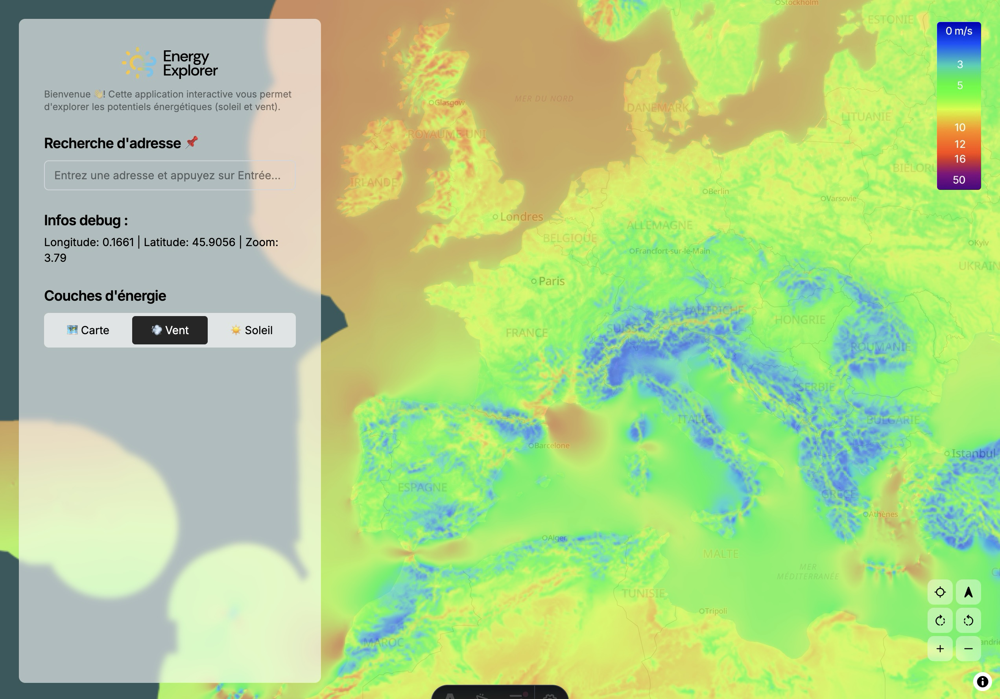
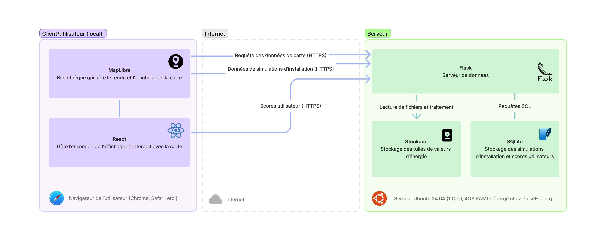

# Energy-Explorer

Energy Explorer est une application web pour visualiser les potentiels de production d'énergie renouvelable (solaire et éolienne) dans le monde.

## Développement

L'application est toujours en développement, mais vous pouvez déjà la tester en vous rendant sur [https://energy-explorer.julienc.me](https://energy-explorer.julienc.me).

### Architecture actuelle

Pour le moment, l'application est constituée d'un backend en Python (Flask) qui sert les données et d'un frontend en React (avec MapLibre GL) qui affiche la carte et les données.

### Schéma de l'architecture

## Auteurs

Ce projet est créé dans le cadre de l'UE Gestion et Réalisation de Projets de l'Université de Pau et des Pays de l'Adour, avec le sujet "Energy Explorer" de Capgemini Pau. Les auteurs sont [Chayma](https://github.com/chaymabb) et [Julien](https://github.com/julien040).